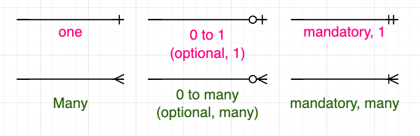

# ERD Components

- `entities`: represented by boxes
    - an object that will have many instances in the database and will be composed of multiple `attributes`
    - naming suggestion: singular noun, concise or use abbrv, ...
- `attribute`: each entiry has multiple attributes
- `relationships`: how entiries interact with each other, represented by lines between the boxes

## Types of entity

types of relationships among entities
- one
- many
- one (and only one)
- zero or one
- one or many
- zero or many

### `ERD Cardinality`  
 

A brief explanation: let's focus on the "0 to many" sign - the tiny circle indicates the min number of links, which the "crow's feet" indicates the max number of links (i.e., can be any number) 
So when the first sign (the left one) is a short line, there has to be at least one existing link.

## Types of Key
`primary key`: an attribute (or field) that *uniquely* identifies every record in a certain table
- thus, one primary key per entity
- `RULES: unique, never changing, never null`

# Reference

- [Entity Relationship Diagram (ERD) Tutorial - Part 1 (YouTube)](https://www.youtube.com/watch?v=QpdhBUYk7Kk)
- [Entity Relationship Diagram (ERD) Tutorial - Part 2 (YouTube)](https://www.youtube.com/watch?v=-CuY5ADwn24)
